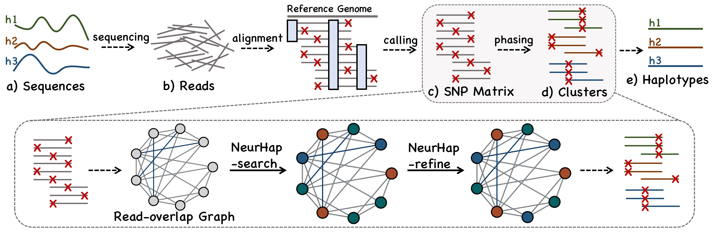

# NeurHap
A PyTorch implementation for the [NeurIPS-2022](https://neurips.cc/Conferences/2022) paper:<br>
Graph Coloring via Neural Networks for Haplotype Phasing of Polyploid Species and Viral Quasispecies [[ArXiv](https://arxiv.org/abs/2210.12158)]<br>
[Hansheng Xue](https://xuehansheng.github.io/), [Vaibhav Rajan](https://sites.google.com/view/vaibhavrajan/), and [Yu Lin](http://users.cecs.anu.edu.au/~u1024708/)

## Overview

<p align="center">
  
</p>

Haplotype phasing is formulated as a graph coloring problem by constructing the Read-overlap graph. NeurHap consists of ***NeurHap***-search, a graph neural network to learn vertex representations and color assignments, and ***NeurHap***-refine, a local refinement strategy to further adjust colors.


## Usage
### Requirement
```
Python 3.6
networkx == 1.11
numpy == 1.18
sklearn == 0.22
pytorch == 1.3.1
```
### Reproducibility
To reproduce the experiments on Sim-Potato Sample 1 dataset, simply run:
```python
python main.py -e 2000 -t 10 -f 32 -k 4 -r 1e-3 -p 6 -q 2 -l 0.01 -d Semi-Potato -s Sample1
```

## Citation
All readers are welcome to star/fork this repository and use it to reproduce our experiments or train your own data. Please kindly cite our paper:
```bibtex
@inproceedings{Xue2022NeurHap,
  title     = {Graph Coloring via Neural Networks for Haplotype Phasing of Polyploid Species and Viral Quasispecies},
  author    = {Xue, Hansheng and Rajan, Vaibhav and Lin, Yu},
  booktitle = {NeurIPS},
  year      = {2022}
}
```